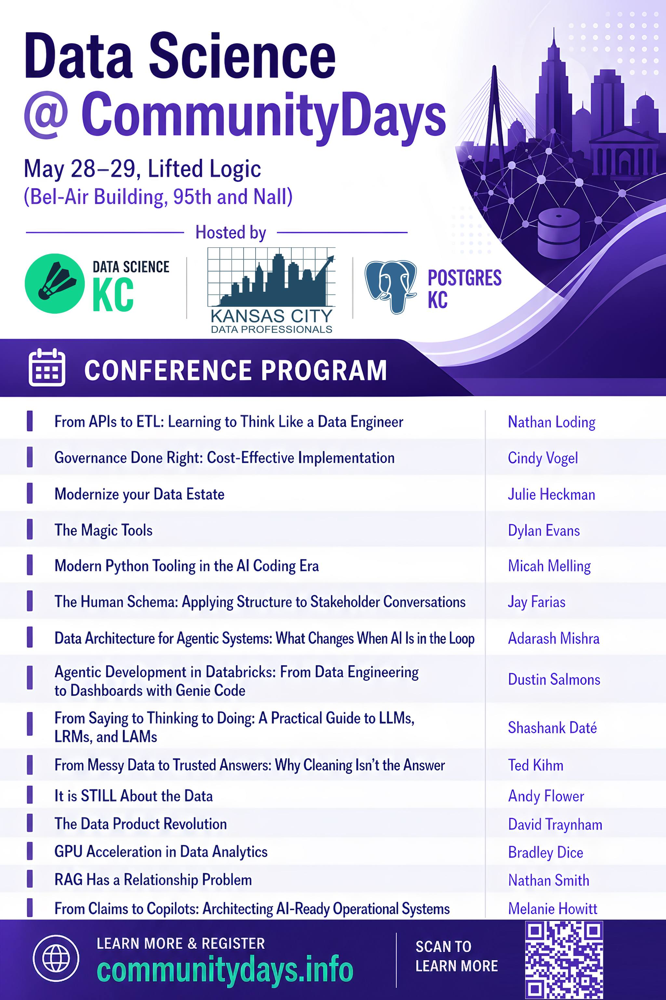

**A super group of Kansas City data organizations is coming together for two days of practical conference sessions.**

Data Science KC is excited to help host **CommunityDays KC 2026** alongside [**KC Data Professionals**](https://kcdataprofessionals.org/) and [**Postgres KC**](https://www.meetup.com/kansas-city-postgres-user-group/). The result is a curated program with broad coverage across data, ops, and AI, built for practitioners who want real technical depth and a strong local network.

[**Register for CommunityDays KC 2026**](https://www.communitydays.info/tickets)

Use discount code `BuildingCommunity` for **10% off** tickets.

- **Dates:** Thursday-Friday, May 28-29, 2026
- **Times:** 9:00 AM-5:00 PM both days, with an attendee party Thursday evening from 5:00 PM-7:00 PM
- **Location:** Lifted Logic, Bel-Air Building, 95th and Nall, Overland Park
- **Format:** Talks across data, ops, and AI

On **May 28 and 29**, you will have access to **15 speakers** bringing expertise across modern data platforms, governance, AI systems, analytics infrastructure, developer tooling, and applied architecture. The lineup reflects the diversity of the local community and should make this a strong event whether you work in engineering, analytics, operations, or applied AI.

Data Science is just **one track** within the larger CommunityDays event, and attendees are encouraged to check out tracks from other local technology groups, including [**Agile KC**](https://www.meetup.com/agile-kc/), [**DevOpsDays KC**](https://devopskc.com/), [**Google Developer Group KC**](https://www.meetup.com/gdg-kansas-city/), [**Global AI KC**](https://globalai.community/chapters/kansas-city/), [**IIBA**](https://kansascity.iiba.org/), [**KC .NET Developers User Group (KCDNUG)**](https://www.meetup.com/kc-net-user-group/), and [**KC Java User Group (KCJUG)**](https://kcjug.github.io/).

## Conference Program

For broader event details and the latest updates, check the official [CommunityDays site](https://www.communitydays.info/).
